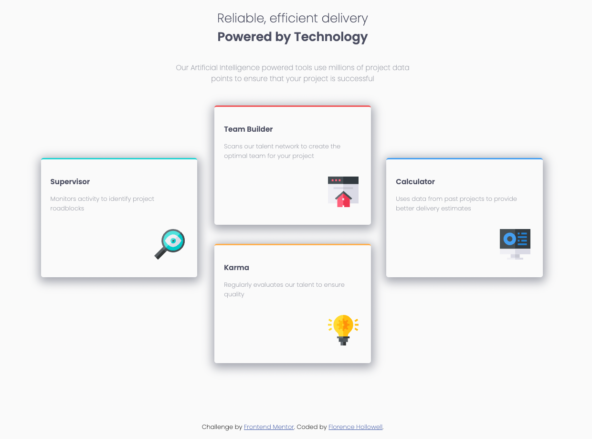

# Frontend Mentor - Four card feature section solution

This is a solution to the [Four card feature section challenge on Frontend Mentor](https://www.frontendmentor.io/challenges/four-card-feature-section-weK1eFYK). Frontend Mentor challenges help you improve your coding skills by building realistic projects. 

## Table of contents

- [Overview](#overview)
  - [The challenge](#the-challenge)
  - [Screenshot](#screenshot)
- [My process](#my-process)
  - [Built with](#built-with)
  - [What I learned](#what-i-learned)
  - [Continued development](#continued-development)
  - [Acknowledgments](#acknowledgments)

## Overview

### The challenge

Users should be able to:

- View the optimal layout for the site depending on their device's screen size

### Screenshot

## My process

### Built with

- Semantic HTML5 markup
- CSS custom properties
- Flexbox
- Mobile-first workflow
- Reponsive 
- [Styled Components](https://styled-components.com/) - For styles

### What I learned

Through out this project I have learned to code a multi-column and responsive layout for a feature section. 

### Continued development

In continuation, I will further develop and refractor my code based off of modern best practices. 

## Acknowledgments

I would like to thank Jaque for the countless hours of studying and coding projects.  Also, the SkillCrush Community has been a blessing to discover as for without them I would not have learned how to code. 

